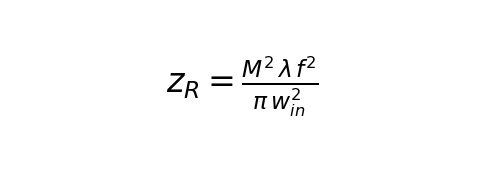
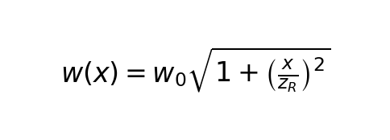
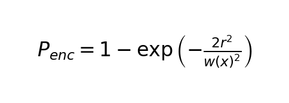
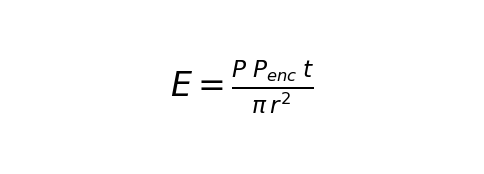
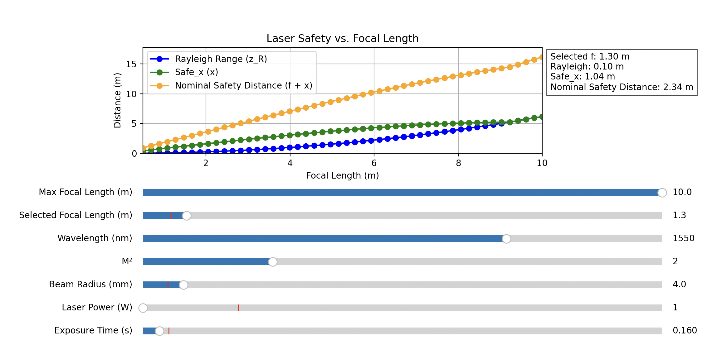
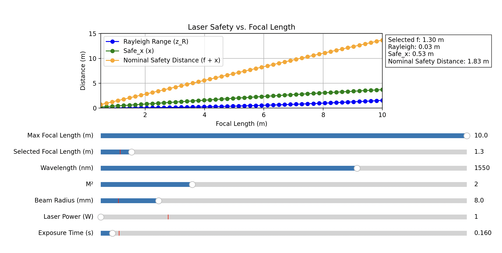
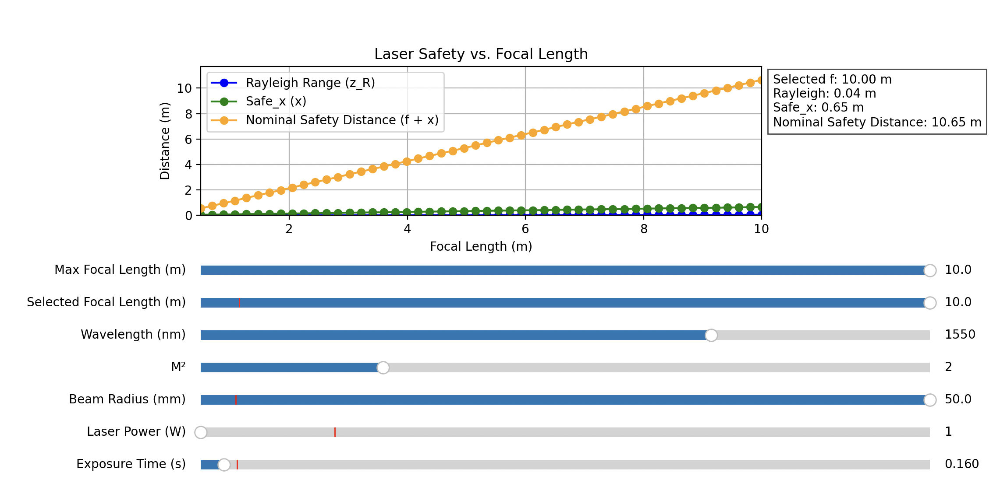

# Laser Safety Calculator

The **Laser Safety Calculator** is an interactive tool that evaluates the nominal safety distance for a laser system. It computes key parameters such as the Rayleigh range and the distance behind the focal point where the energy density on a target (simulated by an extremely small "eye" aperture) falls below a specified safety threshold. This allows users to determine the *Nominal Ocular Hazard Distance (NOHD)* for a given laser configuration.

## Functionality

The calculator uses several input parameters, adjustable via interactive sliders:

- **Max Focal Length:** Maximum focal length (from 0.5 m to 10 m).
- **Selected Focal Length:** A specific focal length value within the above range for which output values are computed.
- **Wavelength:** Laser wavelength in nanometers.
- **M² (Beam Quality):** A factor representing the beam quality.
- **Beam Radius (w<sub>in</sub>):** The input beam radius at the lens in millimeters (adjustable up to 50 mm).
- **Laser Power:** The laser output power in Watts.
- **Exposure Time:** The duration for which the laser is on (in seconds, minimum 0.001 s).

For worst-case analysis, the eye is simulated as an infinitely small aperture (set to 1×10⁻¹⁰ m) to capture the highest concentration of the Gaussian beam distribution.

## Calculation Steps

The safety calculator performs the following computations. The formulas are embedded as screenshots, so they render nicely:

1. **Rayleigh Range Calculation**

   The Rayleigh range (denoted as *z<sub>R</sub>*) is calculated with the formula:

   

   where:
   - *M²* is the beam quality factor.
   - *λ* is the wavelength (in meters).
   - *f* is the focal length (in meters).
   - *w<sub>in</sub>* is the input beam radius (in meters).

2. **Beam Waist Calculation**

   The beam waist at the focal point (denoted as *w<sub>0</sub>*) is given by:

   

3. **Beam Radius as a Function of Distance**

   The beam radius *w(x)*, at a distance *x* behind the focal point, is determined by:

   

4. **Power Enclosed in a Circular Aperture**

   The fraction of beam power captured by a circular aperture (representing the "eye") is computed using:

   

5. **Energy Density Calculation**

   The energy density *E* (in J/m²) delivered to the eye over an exposure time *t* is calculated as:

   

   where:
   - *P* is the laser power.
   - *t* is the exposure time.
   - *r* is the eye radius.

6. **Nominal Safety Distance**

   The safe distance *x* behind the focal point is determined by iterating until the energy density falls below 10,000 J/m². The Nominal Safety Distance is then calculated as: Nominal Safety Distance = f + x

## How to Run and Dependencies

### Dependencies

This project is written in **Python 3.x**. You will also need:
- **NumPy** – for numerical calculations  
- **Matplotlib** – for plotting and interactive sliders  

Install them via pip:

```bash
pip install numpy matplotlib
python laser_safety_calculator.py
```

## Screenshots

Below are example screenshots of the program in action:

### Focal Point = 1.3 m
  


As we can see from the screenshots above, by increasing the initial beam size, we can make the nominal safety zone very small.

### Focal Point = 10 m


As we can see from the screenshots above, when putting the focal point at 10 meter, for example if we want to shoot up from a cart below a tree, up into the canope, where certain insects may be present, or may have put their eggs, the nominal safety zone is still a very workable number.

## Conclusion

The results demonstrate that the nominal safety zone is not much wider for a 1 m focal point. Even with an 8 m focal point, the safety distance remains feasible when combined with additional safety sensors. This indicates that the laser system can be made safe across a range of configurations with appropriate sensor integration and safety measures.

---

*Note: Replace the image filenames with the actual filenames of your formula screenshots. These images must be committed to the same directory as the README.md for the links to work correctly.*
